# 🎬 Remote YouTube Trailer Access Enhancement Plan

## Problem Analysis

**Root Cause**: Our current implementation in [`HoverTrailerController.cs`](Fovty.Plugin.HoverTrailer/Api/HoverTrailerController.cs:152) only accesses **local trailer files**:

```csharp
var trailers = movie.GetExtras(new[] { ExtraType.Trailer });
```

However, Jellyfin stores **remote YouTube trailer metadata** in the `movie.RemoteTrailers` property, which we're completely ignoring. This explains why:
- ✅ Local trailer files work perfectly
- ❌ YouTube trailers accessible via Jellyfin's UI don't work in our plugin

## Solution Architecture

```mermaid
flowchart TD
    A[Client requests trailer for movieId] --> B[HoverTrailerController.GetTrailerInfo]
    B --> C{1. Check Local Trailers}
    C -->|Found| D[✅ Return local trailer stream URL]
    C -->|None| E{2. Check Remote Trailers}
    E -->|Found| F[✅ Return YouTube trailer URL]
    E -->|None| G{3. Check Additional APIs}
    G -->|Found| H[✅ Return external trailer URL]
    G -->|None| I{4. yt-dlp enabled?}
    I -->|Yes| J[⚙️ Download trailer via yt-dlp]
    I -->|No| K[❌ Return 404 - No trailer found]
    J -->|Success| L[✅ Return downloaded trailer URL]
    J -->|Failed| K

    style D fill:#90EE90
    style F fill:#87CEEB
    style H fill:#DDA0DD
    style L fill:#FFB347
    style K fill:#FFB6C1

    subgraph "Data Sources"
        M[movie.GetExtras - Local Files]
        N[movie.RemoteTrailers - YouTube URLs]
        O[Jellyfin API Endpoints - Alternative Sources]
        P[yt-dlp - Download Fallback]
    end
```



## Implementation Plan

### Phase 1: Enhanced Trailer Detection 🔍

**1.1 Add RemoteTrailers Access**
```csharp
// Current (line 152):
var trailers = movie.GetExtras(new[] { ExtraType.Trailer });

// Enhanced approach:
// 1. Local trailers (existing)
var localTrailers = movie.GetExtras(new[] { ExtraType.Trailer });

// 2. Remote trailers (NEW)
var remoteTrailers = movie.RemoteTrailers ?? new List<MediaUrl>();

// 3. Combined detection logic
```

**1.2 Comprehensive Logging Enhancement**
Add detailed debugging for all trailer sources:
- Log count and details of local trailers (existing)
- **NEW**: Log count and details of remote trailers
- **NEW**: Log trailer URLs and types found
- **NEW**: Log which trailer source is ultimately selected

**Target Location**: [`HoverTrailerController.cs`](Fovty.Plugin.HoverTrailer/Api/HoverTrailerController.cs:152-200)

### Phase 2: Multi-Source Trailer Response 📡

**2.1 Enhanced Response Model**
Update the trailer response to handle different source types:
```csharp
public class TrailerInfo
{
    public string TrailerUrl { get; set; }
    public string TrailerType { get; set; } // "local", "remote_youtube", "ytdlp"
    public bool IsRemote { get; set; }
    public string Source { get; set; } // "jellyfin_local", "jellyfin_remote", "ytdlp_download"
    public string Name { get; set; }
    public string Duration { get; set; }
}
```

**2.2 Priority-Based Selection Logic**
```csharp
// Priority order:
// 1. Local trailers (highest quality, fastest)
// 2. Remote YouTube trailers (good quality, no download)
// 3. yt-dlp downloads (fallback, requires download)

BaseItem selectedTrailer = null;
string trailerUrl = null;
string trailerSource = null;
bool isRemote = false;

// 1. Check local trailers first
var localTrailer = localTrailers.FirstOrDefault();
if (localTrailer != null)
{
    selectedTrailer = localTrailer;
    trailerUrl = GetLocalTrailerUrl(localTrailer);
    trailerSource = "jellyfin_local";
    isRemote = false;
}
// 2. Fall back to remote trailers
else if (remoteTrailers.Any())
{
    var remoteTrailer = remoteTrailers.First();
    trailerUrl = remoteTrailer.Url;
    trailerSource = "jellyfin_remote";
    isRemote = true;
}
// 3. Fall back to yt-dlp if enabled
else if (config.EnableTrailerDownload)
{
    // Existing yt-dlp logic
}
```

### Phase 3: Code Implementation Details 💻

**3.1 Specific Code Changes Required**

**File**: `Fovty.Plugin.HoverTrailer/Api/HoverTrailerController.cs`

**Location**: After line 152 (after `var trailers = movie.GetExtras(new[] { ExtraType.Trailer });`)

**Add this code**:
```csharp
// Add remote trailer detection
var remoteTrailers = movie.RemoteTrailers?.ToList() ?? new List<MediaUrl>();
LoggingHelper.LogDebug(_logger, "Found {RemoteTrailerCount} remote trailers for movie: {MovieName}",
    remoteTrailers.Count, movie.Name);

// Log details of each remote trailer
foreach (var remoteTrailer in remoteTrailers)
{
    LoggingHelper.LogDebug(_logger, "Remote trailer: Name={Name}, Url={Url}, Type={Type}",
        remoteTrailer.Name ?? "Unknown", remoteTrailer.Url, remoteTrailer.Type ?? "Unknown");
}

// Enhanced selection logic
BaseItem selectedLocalTrailer = trailers.FirstOrDefault();
MediaUrl selectedRemoteTrailer = remoteTrailers.FirstOrDefault();

string finalTrailerUrl = null;
string trailerSource = null;
bool isRemoteTrailer = false;

if (selectedLocalTrailer != null)
{
    // Use local trailer (highest priority)
    LoggingHelper.LogDebug(_logger, "Using local trailer: {TrailerName}", selectedLocalTrailer.Name);
    finalTrailerUrl = GetLocalTrailerStreamUrl(selectedLocalTrailer);
    trailerSource = "jellyfin_local";
    isRemoteTrailer = false;
}
else if (selectedRemoteTrailer != null)
{
    // Use remote trailer (second priority)
    LoggingHelper.LogDebug(_logger, "Using remote trailer: {TrailerName} - {TrailerUrl}",
        selectedRemoteTrailer.Name, selectedRemoteTrailer.Url);
    finalTrailerUrl = selectedRemoteTrailer.Url;
    trailerSource = "jellyfin_remote";
    isRemoteTrailer = true;
}
```

**3.2 Update the Error Handling Logic**

**Location**: Replace the existing error return (around line 196-200)

**Replace**:
```csharp
if (trailer == null)
{
    LoggingHelper.LogDebug(_logger, "No trailer found for movie: {MovieName} (ID: {MovieId})", movie.Name, movieId);
    // ... existing directory checking logic ...
    var error = new ErrorResponse("TRAILER_NOT_FOUND", "No trailer found for this movie", $"Movie '{movie.Name}' does not have any trailers")
    {
        RequestId = requestId
    };
    return NotFound(error);
}
```

**With**:
```csharp
if (string.IsNullOrEmpty(finalTrailerUrl))
{
    LoggingHelper.LogDebug(_logger, "No local or remote trailers found for movie: {MovieName} (ID: {MovieId})", movie.Name, movieId);

    // ... existing directory checking logic ...

    // Check if yt-dlp is enabled as final fallback
    if (config.EnableTrailerDownload)
    {
        LoggingHelper.LogDebug(_logger, "Attempting yt-dlp download fallback for movie: {MovieName}", movie.Name);
        // Existing yt-dlp logic would go here
    }
    else
    {
        LoggingHelper.LogDebug(_logger, "yt-dlp download disabled, no trailer available for movie: {MovieName}", movie.Name);
        var error = new ErrorResponse("TRAILER_NOT_FOUND", "No trailer found for this movie",
            $"Movie '{movie.Name}' has no local trailers, no remote trailers, and external download is disabled")
        {
            RequestId = requestId
        };
        return NotFound(error);
    }
}
```

**3.3 Update the Success Response**

**Location**: Replace the existing success response logic

**Add enhanced response with trailer source information**:
```csharp
var response = new
{
    TrailerUrl = finalTrailerUrl,
    TrailerSource = trailerSource,
    IsRemote = isRemoteTrailer,
    MovieName = movie.Name,
    TrailerType = selectedLocalTrailer?.Name ?? selectedRemoteTrailer?.Name ?? "Unknown",
    RequestId = requestId
};

LoggingHelper.LogInfo(_logger, "Trailer found for movie: {MovieName}, Source: {TrailerSource}, IsRemote: {IsRemote}",
    movie.Name, trailerSource, isRemoteTrailer);

return Ok(response);
```

### Phase 4: Client-Side Compatibility 💻

**4.1 JavaScript Client Updates**

**File**: The injected client script in `Plugin.cs`

**Required Changes**:
- Ensure video element can handle YouTube URLs
- Add proper error handling for different trailer types
- Update success/error messages to indicate trailer source

**4.2 Video Element Handling**
```javascript
// The client script needs to handle both:
// 1. Jellyfin stream URLs: `/Videos/{videoId}/stream?api_key=...`
// 2. YouTube URLs: `https://www.youtube.com/watch?v=...`

function loadTrailer(trailerData) {
    const videoElement = document.getElementById('trailerVideo');

    if (trailerData.IsRemote && trailerData.TrailerSource === 'jellyfin_remote') {
        // Handle YouTube URLs
        videoElement.src = trailerData.TrailerUrl;
    } else {
        // Handle local Jellyfin streams
        videoElement.src = trailerData.TrailerUrl;
    }
}
```

### Phase 5: Testing Strategy 🧪

**5.1 Test Cases to Validate**

1. **Movies with only local trailers**
   - Expected: Uses local trailer, `TrailerSource: "jellyfin_local"`

2. **Movies with only remote YouTube trailers**
   - Expected: Uses remote trailer, `TrailerSource: "jellyfin_remote"`

3. **Movies with both local and remote trailers**
   - Expected: Prioritizes local trailer

4. **Movies with no trailers (yt-dlp disabled)**
   - Expected: Returns 404 with enhanced error message

5. **Movies with no trailers (yt-dlp enabled)**
   - Expected: Falls back to yt-dlp download

**5.2 Logging Validation**

After implementation, check logs for:
```
[DEBUG] Found X local trailers for movie: MovieName
[DEBUG] Found Y remote trailers for movie: MovieName
[DEBUG] Remote trailer: Name=TrailerName, Url=https://youtube.com/..., Type=Trailer
[DEBUG] Using local/remote trailer: TrailerName
[INFO] Trailer found for movie: MovieName, Source: jellyfin_local/jellyfin_remote, IsRemote: true/false
```

## Expected Outcomes

After implementation:
- 🎯 **Immediate**: Movies with YouTube trailers in Jellyfin will work in the hover plugin
- 🎯 **Enhanced**: Better debugging information for trailer detection issues
- 🎯 **Robust**: Fallback chain ensures maximum trailer availability
- 🎯 **Future-proof**: Architecture supports additional trailer sources

## Risk Assessment & Mitigation

| Risk | Impact | Mitigation |
|------|--------|------------|
| RemoteTrailers property empty | Medium | Comprehensive logging + yt-dlp fallback |
| YouTube URL format incompatibility | Medium | Error handling + local trailer priority |
| Client video element compatibility | Medium | Progressive enhancement + testing |
| Performance impact from multiple checks | Low | Efficient early returns + caching |

## Implementation Checklist

- [ ] **Phase 1**: Add RemoteTrailers access and logging
- [ ] **Phase 2**: Implement priority-based selection logic
- [ ] **Phase 3**: Update error handling and success responses
- [ ] **Phase 4**: Test client-side YouTube URL handling
- [ ] **Phase 5**: Comprehensive testing with different movie types
- [ ] **Phase 6**: Monitor logs and performance after deployment

---

**This implementation directly addresses the core issue: accessing Jellyfin's existing remote trailer metadata that's currently being ignored by our plugin, enabling YouTube trailers to work seamlessly in the hover interface.**

## Next Steps

1. **Switch to Code mode** to begin implementation
2. **Start with Phase 1**: Enhanced trailer detection and logging
3. **Deploy and test** with comprehensive logging to validate the approach
4. **Iterate** based on real-world trailer detection results